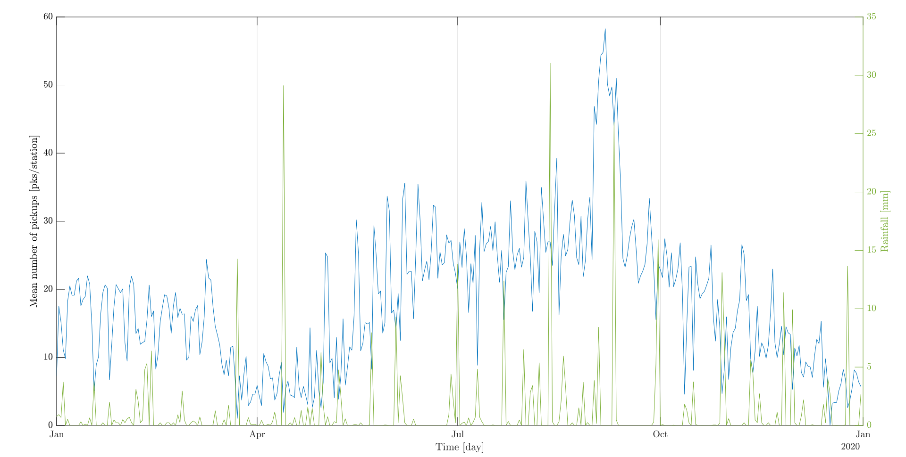
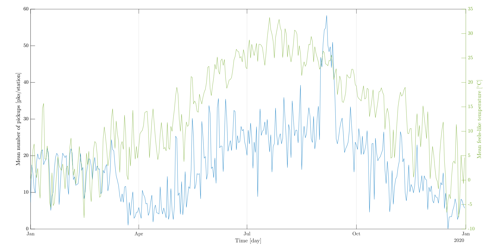
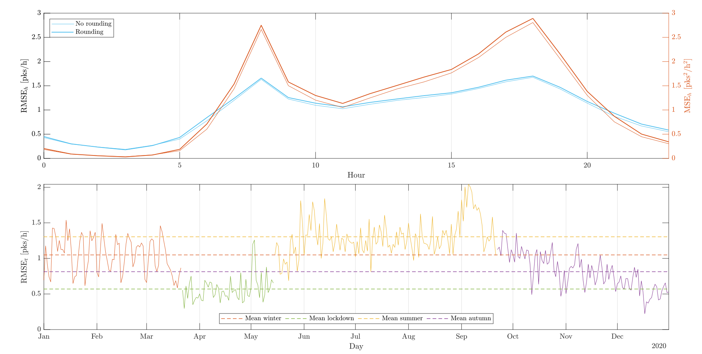

# Statistical analysis of Jersey City bike sharing data using spatio-temporal models #

## Contributors ##
+ Alessandro CHAAR, postgraduate in Computer Engineering at University of Bergamo.
+ Lorenzo LEONI, postgraduate in Computer Engineering at University of Bergamo.
+ Nicola ZAMBELLI, postgraduate in Computer Engineering at University of Bergamo.

- [x] *Map of bike sharing and subway/train stations in Jersey City*.

## Abstract ##
Is it possible to predict how many bikes to place at a rental station to optimize the bike sharing service? Starting from 2020 Jersey City (NYC) bike staring data, the aim of this study is to find an answer to this question estimating three different spatio-temporal models. The historical weather data (and not only) will try to explain the daily (and hourly) number of pickups at a station in order to help the service provider in its planning.

## Key words ##
Bike sharing, DCM, HDGM, f-HDGM, D-STEAM.

## Datasets ##
The original bike sharing dataset comes from the website [Kaggle](https://www.kaggle.com/datasets/vineethakkinapalli/citibike-bike-sharingnewyork-cityjan-to-apr-2021) and contains the bicycle rental information in 2020 of the company *Citi Bike* in Jersey City. Citi Bike is a privately owned public bicycle sharing system serving the New York City boroughs of the Bronx, Brooklyn, Manhattan, and Queens, as well as Jersey City. The weather dataset, instead, contains the most significant meteorological variables' time series about NYC in 2020 and comes from the historical weather data database that the website [Visual Crossing](https://www.visualcrossing.com/weather-data) makes available for the users. Moreover, we have constructed two logical dummy variables to describe the weekends and events that have occurred in New York City in 2020, i.e. the US federal holidays and the lockdown due to the COVID-19 pandemic. Through a preliminary data processing work, we have extracted from the original datasets the variables of our interest by grouping data to obtain daily and hourly information.

## Aim ##
The aim of this study is to analyse the bike sharing phenomenon in Jersey City by using a statistical approach which involves the use of spatio-temporal models to describe the number of pickups and the mean trip duration (the observed variables) at each of 51 stations at a specific time instant. Specifically, the goals are the following:
- **inference**: how the weather variables, events and the distance between every bike sharing station and the nearest subway/train station (the covariates) can help us to describe the observed variables? Which are the most significant covariates?
- **models validation**: fixed some bike stations, which is the best spatio-temporal model among those we are taken into account in predicting the time series regarding the pickups and the mean trip duration of these test stations?

## Some contents ##

- [x] *Main statistics concerning bike sharing variables*.

| Bike sharing variable | Unit of measure | Minimum | Mean | Median | Maximum | Standard deviation | Skewness | Kurtosis |
|:---------------------:|:---------------:|:-------:|:----:|:------:|:-------:|:------------------:|:--------:|:--------:|
| *Mean daily rentals*  |Dimensionless    |0.06     |18.04 |17.32   |58.27    |10.24               |0.88      |4.35      |
| *Mean trip duration*  |min              |6.60     |26.76 |21.30   |387.21   |28.92               |7.08      |75.13     |
| *Distance*            |km               |0.05     |0.49  |0.35    |1.29     |0.36                |0.89      |2.65      |

- [x] *Comparison between the mean number of daily pickups at rental stations and rainfall*.

- [x] *Comparison between the mean number of daily pickups at rental stations and mean feels-like temperature*.

- [x] *Trends of the* $RMSE_h$ *and* $RMSE_t$ *concerning the medium f-HDG model*.

